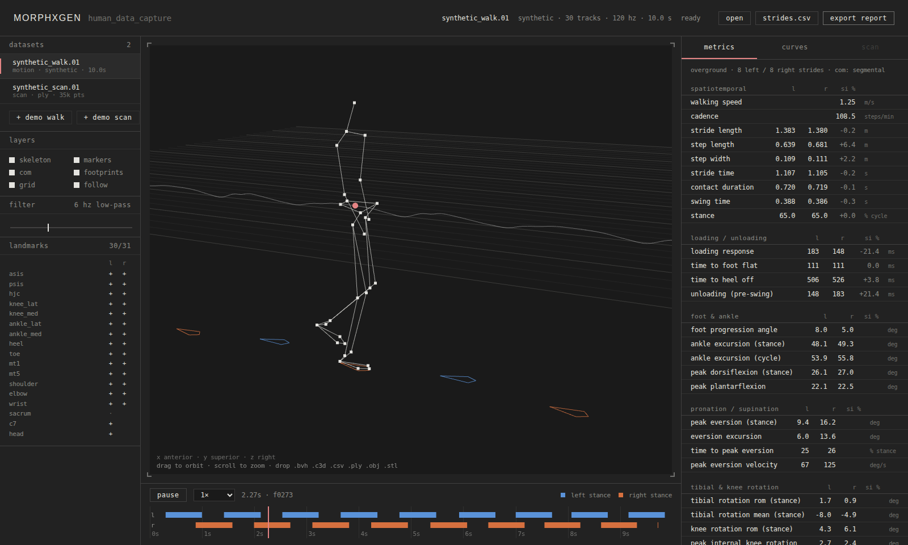

# human_data_capture

A browser tool for human data capture, analysis and visualisation. Drop in
motion capture or a 3D body scan and get kinematic morphology, gait
metrics, cycle curves and anthropometrics. Everything runs client-side, so
data never leaves the machine.



See [ARCHITECTURE.md](./ARCHITECTURE.md) for the full outline, metric
definitions and roadmap, and
[MORPHXGEN-visual-language.md](./MORPHXGEN-visual-language.md) for the
visual system.

```bash
npm install
npm run dev        # http://localhost:5173
npm test           # analysis + format tests (vitest)
npm run build      # typecheck + production bundle → dist/
```

The app opens on a synthetic walker and a synthetic scan, so every panel is
populated before you have data of your own.

## Ingest

| type | formats |
|---|---|
| motion capture | `.asx` / `.asf` + `.amc` · `.bvh` · `.c3d` · `.csv` / `.tsv` marker trajectories |
| body scan | `.ply` · `.obj` · `.stl` (mesh or point cloud) |

Drop files on the stage or use **open**. Units, up-axis and walking
direction are inferred from the body itself. Marker names are mapped to
canonical landmarks (Plug-in Gait, CAST, Qualisys, the CMU marker set and
mixamo/CMU joint names out of the box); the sidebar shows what resolved.

### CMU Motion Capture Database

[mocap.cs.cmu.edu](http://mocap.cs.cmu.edu) publishes each trial in three
formats, and all three load with landmarks picked up automatically:

| CMU files | what happens |
|---|---|
| `NN.asx` + `NN_MM.amc` | skeleton + trial (the skeleton is plain Acclaim ASF; `.asf` works too). Drop both together, or the skeleton once and then any number of that subject's `.amc` trials: `02_01.amc` is paired with `02.asx` by name. When names don't line up, the latest skeleton is used and flagged; the sidebar's **skeleton** block lets you pick any loaded skeleton for the trial, or load another `.asx` straight into it. Virtual markers (knee/ankle med+lat, heel, toe, MT1/MT5, ASIS/PSIS) are attached to the bones, so every metric is available. AMC has no frame rate; CMU's 120 Hz is assumed. |
| `NN_MM.c3d` | the raw 41-marker Vicon data. Waist markers `LFWT/RFWT/LBWT/RBWT` stand in for ASIS/PSIS (hip centres are estimated from them); DEC-format files, common in the database, are supported. The set has no medial knee/ankle or MT1 markers, so axial rotations and inversion are reported as `proxy`. |
| `NN_MM.bvh` | community BVH conversions (`LHipJoint`, `LeftUpLeg`, ... naming) load like any other BVH. |

Many CMU walks curve or turn; per-step measures (step length and width,
foot progression, tibial rotation, COM sway) follow the walker's heading
rather than a fixed axis. A slightly tilted capture floor (07_01 climbs
~0.9°) is levelled before heights are measured. CMU knees are hinges, so
knee axial rotation is reported as unavailable for ASF/AMC trials.

Subject 07's skeleton and walk `07_01` are checked in under
`tests/fixtures/` and tested end to end: cadence, stride and step length,
stance, and a knee angle that matches the trial's own `ltibia` channel.

## Analysis

| group | metrics |
|---|---|
| spatiotemporal | walking speed, cadence, stride / step length, step width, stride time, contact duration, swing, stance % |
| loading / unloading | loading response, time to foot flat, time to heel off, pre-swing unloading |
| foot & ankle | foot progression angle, ankle excursion (stance / cycle), peak dorsi / plantarflexion |
| pronation / supination | peak eversion, eversion excursion, time to peak, eversion velocity, pattern |
| tibial & knee rotation | tibial rotation rom / mean, knee rotation rom / peak, loading knee flexion |
| centre of mass | 3d trajectory, vertical and mediolateral excursion |
| ground reaction force (estimated) | per-foot 3d vector from COM acceleration (×BW): vertical loading / push-off peaks, midstance minimum, loading rate, braking, propulsion, medial; vertical / fore-aft / mediolateral curves; vector arrows in the 3d view |
| variability | cv % of stride time, stride length, contact, swing, step width |
| coordination | inter-limb phase, phase coordination index, symmetry indices |
| scan | stature, width, depth, area, volume, girth profile, named girths |

Each metric reports left / right / pooled values and says when it is a
proxy or unavailable because landmarks are missing.

## Exports

- **export report**: JSON with every metric, per-stride rows and mean curves
- **strides.csv**: one row per stride, for spreadsheets

## Deploying

Same as `mo_graph`: `.github/workflows/deploy.yml` builds and publishes to
GitHub Pages on every push to `main`. The Pages source must be:

> **Settings → Pages → Build and deployment → Source: GitHub Actions**

**Not** "Deploy from a branch". That setting publishes the repo root, whose
dev `index.html` loads `/src/main.tsx`, which no browser can execute: the
symptom is a blank page whose source still shows `src="/src/main.tsx"`.

Pages names each deployment after its commit. If a commit was ever served by
the branch publisher, re-running the workflow on that *same* commit keeps
serving the stale copy; push a new commit to `main` to get a fresh
deployment.
